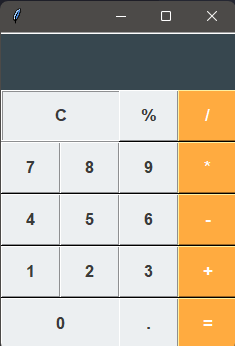

# 🧮 Calculadora Python (Tkinter)

Calculadora funcional com interface gráfica desenvolvida em Python.

## 🚀 Funcionalidades
* Operações matemáticas básicas (+, -, *, /)
* Cálculo de porcentagem
* Interface moderna com cores customizadas
* Limpeza de tela (Botão C)

## 🛠️ Tecnologias
* **Python 3**
* **Tkinter** (Interface Gráfica)

## 🔧 Como Executar
1. Instale o Python em sua máquina.
2. Salve o código em um arquivo chamado `main.py`.
3. Execute o comando:
   ```bash
   python main.py

## 📸 Preview


